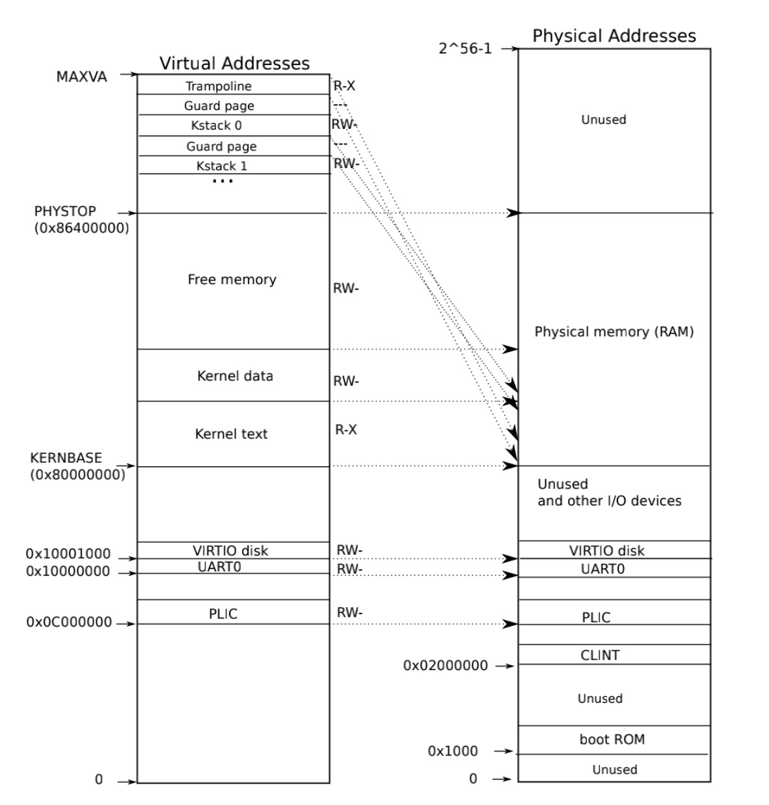
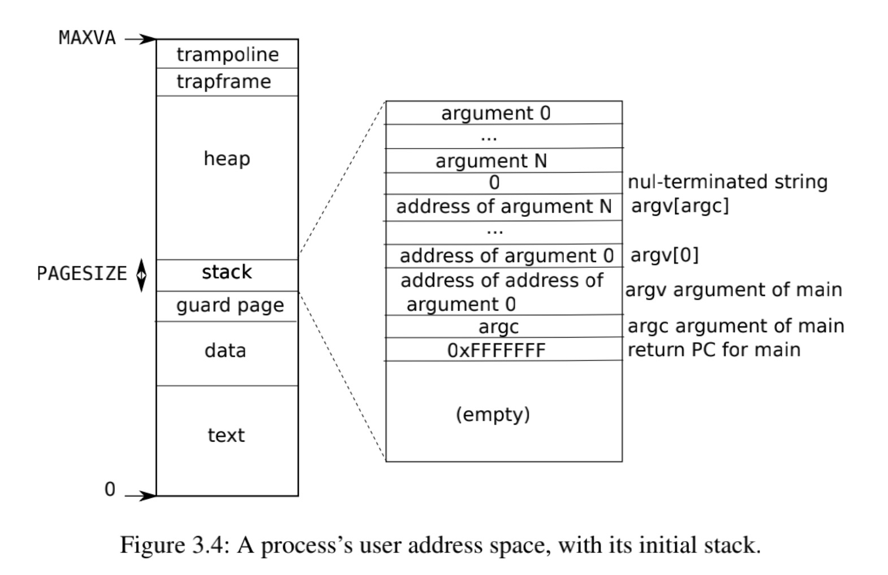

*author:Sukuna*

### 内存管理

##### 分页的硬件

RISC-V的指令(包括用户态下的或者内核态下的)提供了虚拟地址.但是对应地,RAM或者叫做物理内存,自然也有物理地址,物理地址真实唯一地标记实际内存空间,我们需要利用RISC-V的页表硬件来完成虚拟地址和物理地址的转换.

我们的页表使用`Sv39`架构,`SV39`维护的是一个多级页表:我们发现页表是三级结构,第一层页表的首地址保存在`satp`寄存器中,有$512$个表项,其中表项存储着下一级页表(第二层)的首地址.第二级页表也是由$512$个表项组成,其中每一个表项存着下一级页表(第三层)的首地址.第三级页表里面存储的就是对应的物理地址的PPN.

所以说$va$分成$L2$,$L1$,$L0$和$Offset$分成四部分.

- 首先在第一级页表中找到第L2个表项,这样就找到第二级页表的首地址.
- 然后在第二级页表中找到第L1个表项,这样就找到第三级页表的首地址.
- 最后在第三级页表中找到第L0个表项,这样就能获取到PPN,然后拿PPN和offset组合在一起就可以了.
- 如果在任何一次寻找的时候Flags显示这个页表项不可用,那么就引发缺页中断.

但是CPU这样去访问页表需要3次访存操作,导致访问速度降低,因此底层硬件存在一个类似于cache的东西来保存页表信息,这个表叫做`TLB`.CPU首先会在TLB中查找页表元素.如果TLB miss了才会调用访存操作来获取页表元素.

每一个页表都保存若干个页表元素,每一个页表元素都都存储了`flag`位,其中`PTE_V`存着这个页表项究竟是不是可用的.`PTE_W`表示指令是否可以往这个页是否可写,`PTE_X`表示这个页是否可执行,`PTE_U`表示在用户态下是否可以访问这一页.

在硬件层面上我们必须指定第一级页表的首地址,这个页表首地址存放在`satp`寄存器中,由于每个CPU的寄存器相互独立,所以说不同CPU的`satp`寄存器的值都是不一样的,这为每个CPU运行不同的进程提供了硬件支持.

**内核地址空间**

下面这张图表现了本操作系统在内核态下的基本布局:




在`vm.c`中的`kvminit`中,这个函数构建了一个内核态的页表,执行了下面的操作:

- 对于中断控制`context`以及有关设备进行地址映射.所有的宏定义都存储在`memlayout.h`中.
- 内核代码区、数据区以及自由空间全部设置成直映射.并且设置相应的访存权限.
- 在虚拟地址区域的最顶部即`TRAMPOLINE`处与`trampoline`处进行映射.

```C
void
kvminit()
{
  kernel_pagetable = (pagetable_t) kalloc();
  // printf("kernel_pagetable: %p\n", kernel_pagetable);

  memset(kernel_pagetable, 0, PGSIZE);
  
  //uint64 FAT32_SIZE=(FAT32_END-FAT32_START+PGSIZE-1)/PGSIZE*PGSIZE;
  //printf("fat32end:%p\n",FAT32_END);
  // file system
  //kvmmap(FAT32_START_V, FAT32_START, FAT32_SIZE, PTE_R | PTE_W);
  // uart registers
  kvmmap(UART0_V, UART0, PGSIZE, PTE_R | PTE_W);
  
  #if QEMU!=SIFIVE_U
  // virtio mmio disk interface
  kvmmap(VIRTIO0_V, VIRTIO0, PGSIZE, PTE_R | PTE_W);
  #endif
  // CLINT
  kvmmap(CLINT_V, CLINT, 0x10000, PTE_R | PTE_W);

  // PLIC
  kvmmap(PLIC_V, PLIC, 0x400000, PTE_R | PTE_W);

  #if QEMU==SIFIVE_U
  // GPIOHS
  kvmmap(GPIOHS_V, GPIOHS, 0x1000, PTE_R | PTE_W);

  // DMAC
  kvmmap(DMAC_V, DMAC, 0x1000, PTE_R | PTE_W);

  // GPIO
  // kvmmap(GPIO_V, GPIO, 0x1000, PTE_R | PTE_W);

  // SPI_SLAVE
  kvmmap(SPI_SLAVE_V, SPI_SLAVE, 0x1000, PTE_R | PTE_W);

  // FPIOA
  kvmmap(FPIOA_V, FPIOA, 0x1000, PTE_R | PTE_W);

  // SPI0
  kvmmap(SPI0_V, SPI0, 0x1000, PTE_R | PTE_W);

  // SPI1
  kvmmap(SPI1_V, SPI1, 0x1000, PTE_R | PTE_W);

  // SPI2
  kvmmap(SPI2_V, SPI2, 0x1000, PTE_R | PTE_W);

  // SYSCTL
  kvmmap(SYSCTL_V, SYSCTL, 0x1000, PTE_R | PTE_W);
  
  #endif
  
  // map rustsbi
  // kvmmap(RUSTSBI_BASE, RUSTSBI_BASE, KERNBASE - RUSTSBI_BASE, PTE_R | PTE_X);
  // map kernel text executable and read-only.
  kvmmap(KERNBASE, KERNBASE, (uint64)etext - KERNBASE, PTE_R | PTE_X);
  // map kernel data and the physical RAM we'll make use of.
  kvmmap((uint64)etext, (uint64)etext, PHYSTOP - (uint64)etext, PTE_R | PTE_W);
  // map the trampoline for trap entry/exit to
  // the highest virtual address in the kernel.
  kvmmap(TRAMPOLINE, (uint64)trampoline, PGSIZE, PTE_R | PTE_X);

  #ifdef DEBUG
  printf("kvminit\n");
  #endif
}
```

当上述函数构建好`kernel_pagetable`,也就是内核态的页表的时候,所有核就可以调用`kvminithart`函数来把页表载入到`satp`寄存器中.

```C
void
kvminithart()
{
  w_satp(MAKE_SATP(kernel_pagetable));
  // reg_info();
  sfence_vma();
  #ifdef DEBUG
  printf("kvminithart\n");
  #endif
}
```

#### 内存系统关键函数

首先需要关注一个数据结构,这个就是`pagetable_t`这个数据结构本质上就是一个`uint64*`类型的一个指针,这个代表了第一级页表的首地址.可以是用户进程页表的首地址,也可以是内核页表的首地址.

1、`walk`函数,这个函数输入一个`va`,返回对应的`PTE`.

```C
pte_t *
walk(pagetable_t pagetable, uint64 va, int alloc)
{
  
  if(va >= MAXVA)
    panic("walk");

  for(int level = 2; level > 0; level--) {
    pte_t *pte = &pagetable[PX(level, va)];
    if(*pte & PTE_V) {
      pagetable = (pagetable_t)PTE2PA(*pte);
    } else {
      if(!alloc || (pagetable = (pde_t*)kalloc()) == NULL)
        return NULL;
      memset(pagetable, 0, PGSIZE);
      *pte = PA2PTE(pagetable) | PTE_V;
    }
  }
  return &pagetable[PX(0, va)];
}
```

这个函数与之前第一节的给定虚拟地址寻找页表项的方法是一样的.

2、`mappages`函数.这个函数可以添加页表项,添加`va`到`pa`的地址映射.

```C
int
mappages(pagetable_t pagetable, uint64 va, uint64 size, uint64 pa, int perm)
{
  uint64 a, last;
  pte_t *pte;

  a = PGROUNDDOWN(va);
  last = PGROUNDDOWN(va + size - 1);
  
  for(;;){
    if((pte = walk(pagetable, a, 1)) == NULL)
      return -1;
    if(*pte & PTE_V)
      panic("remap");
    *pte = PA2PTE(pa) | perm | PTE_V;
    if(a == last)
      break;
    a += PGSIZE;
    pa += PGSIZE;
  }
  return 0;
}
```

首先需要找到应该插入的页表项地址,然后写入即可.

3、`copyin`函数:这个函数可以把用户态的数据写入到内核态的地址空间中.

4、`copyout`函数:这个函数可以把内核态的数据写入到用户态的地址空间中.

5、`walkaddr`函数:这个函数这个函数输入一个`va`,返回对应的`pa`.该函数的功能基于`walk`函数.

6、`vmunmap`函数:这个函数通过给定一个`va`地址和释放的页数,将`va,va+npages*PGSIZE`这段虚拟地址空间释放.

#### 物理块管理函数

基本的物理块管理函数在`kalloc.c`中定义

1、`kinit`函数,这个函数初始化可用的物理地址空间.

```C
void
kinit()
{
  initlock(&kmem.lock, "kmem");
  freerange(end, (void*)PHYSTOP);
}
```

2、`kalloc`函数,这个函数可以返回一个可用的物理地址空间.

```C
void *
kalloc(void)
{
  struct run *r;

  acquire(&kmem.lock);
  r = kmem.freelist;
  if(r)
    kmem.freelist = r->next;
  release(&kmem.lock);

  if(r)
    memset((char*)r, 5, PGSIZE); // fill with junk
  return (void*)r;
}
```

我们知道,每次申请都会调用一次kalloc函数.kalloc函数每一次从freelist中取出一块来进行返回.这个freelist已经在kinit函数中初始化好了.

3、`kfree`函数,这个函数可以把一个`pa`加入到可用的物理地址空间中.

```C
void
kfree(void *pa)
{
  struct run *r;

  if(((uint64)pa % PGSIZE) != 0 || (char*)pa < end || (uint64)pa >= PHYSTOP)
    panic("kfree");

  // Fill with junk to catch dangling refs.
  memset(pa, 1, PGSIZE);

  r = (struct run*)pa;

  acquire(&kmem.lock);
  r->next = kmem.freelist;
  kmem.freelist = r;
  release(&kmem.lock);
}
```

同样,在释放的时候,也是获得这个释放的物理块地址,把它放到freelist的队首中.

#### 用户进程地址空间



用户地址空间是从`0`开始,一直到`MAXVA`.然后当用户程序需要更多的内存的时候,操作系统就会使用`kalloc`函数来获取新的页,然后接着建立`pa`和`va`的关系.对于虚拟地址,如果用户进程暂时不需要使用这一部分的地址,就可以把页表项的PTE_V位置0表示不需要使用.

下面有几个要提及的点:

- 一个用户进程只使用一张页表,不同的用户进程的物理地址是相互隔离,所以这保证程序的独立性.
- 用户看见的虚拟地址是连续的但其实物理地址不是连续的,这样加大了分配的灵活性.
- `trampoline`页是所有用户通用的,也就是说每个用户的页表一定有一个`MAXVA-PGSIZE->trampoline`的映射.

`trapframe`页直接映射到可用物理空间,在`kernel`态是直接映射的,所以说不用担心`kernel`态访问不了用户态的`trapframe`.

`stack`页存放由exec程序创建的各种参数以及参数的地址.并且还保存`main`执行完应该返回的`PC`.

在每个用户进程创建之前都会调用一次`uvminit`函数以创建对应用户进程的页表:页表的映射与上文描述相同.

```C
void
uvminit(pagetable_t pagetable, pagetable_t kpagetable, uchar *src, uint sz)
{
  char *mem;

  if(sz >= PGSIZE)
    panic("inituvm: more than a page");
  mem = kalloc();
  // printf("[uvminit]kalloc: %p\n", mem);
  memset(mem, 0, PGSIZE);
  mappages(pagetable, 0, PGSIZE, (uint64)mem, PTE_W|PTE_R|PTE_X|PTE_U);
  mappages(kpagetable, 0, PGSIZE, (uint64)mem, PTE_W|PTE_R|PTE_X);
  memmove(mem, src, sz);
  // for (int i = 0; i < sz; i ++) {
  //   printf("[uvminit]mem: %p, %x\n", mem + i, mem[i]);
  // }
}
```

